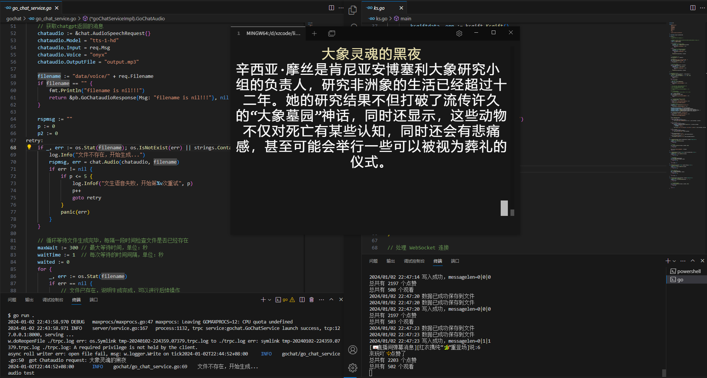

**<span style="color:blue">
基于TPRC-GO框架的直播机器人
</span>**



## 功能
- 直播间人数、点赞数统计
- 直播间弹幕信息
- 直播间点赞信息
- 直播间礼物信息
- 调用openaiapi生成文本
- 调用openaiapi文字转语音
- ... todo
## 支持直播间
- 快手
- ... todo
## 接入模型
- gpt-3.5-turbo
- tts-1-hd
- ... todo

## 环境
- Go 1.21.4
- Python 3.10.11
## 依赖
- [tRPC-Go](https://github.com/trpc-group/trpc-go/blob/main/README.zh_CN.md)
- [openaiapi](https://chat.openai.com/)
## 使用方法
```bash
# 运行 go server
cd gochat/gochat
go run .
# 启用 websockt 监听直播间消息
cd kuaishou_websocket-master
python main.py
# 运行 go websocket 处理直播间相关信息
cd /ksweb
go run ks.go
# 运行 client 向server发起RPC请求实现客户端相关逻辑
cd /ksweb/luobo
go run lunbo.go
```
## 注意事项
- openaiapi密钥及直播间id自行更改
- 作者仅供学习交流使用，请勿用于商业用途
- 作者平时很忙，有空会继续做下去，不喜勿喷
- 欢迎star，有问题欢迎issue
## 致谢
- [tRPC-Go](https://github.com/trpc-group/trpc-go/blob/main/README.zh_CN.md)
- [openaiapi](https://chat.openai.com/)
- [kuaishou_websocket-master](https://github.com/Superheroff/kuaishou_websocket/tree/master)

## 联系方式
- 微信: GUO2659350920
